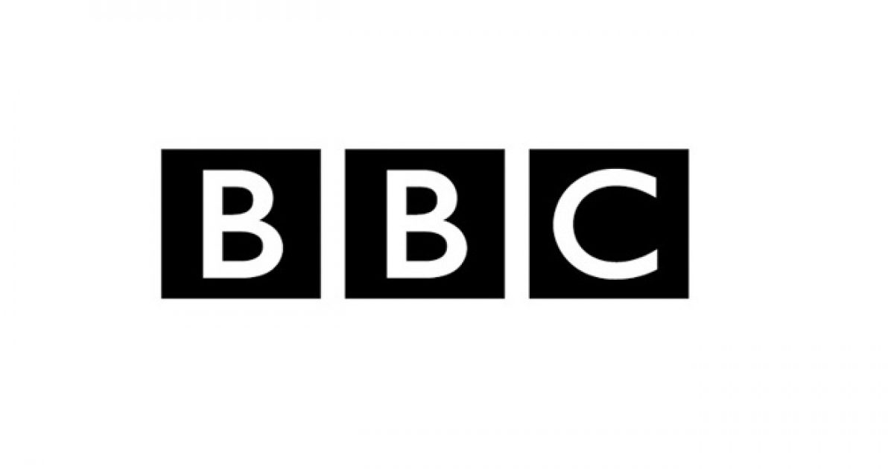
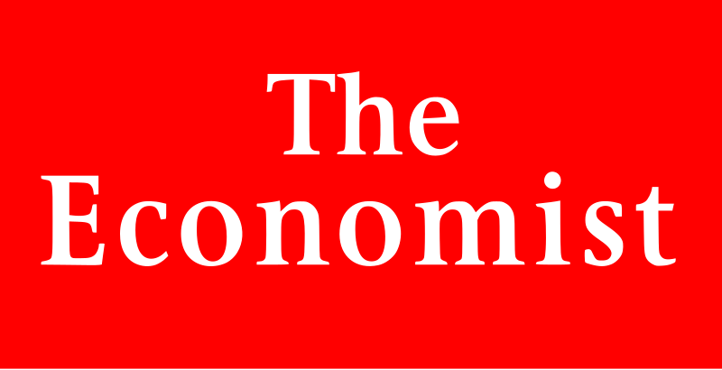

# Guide to Civic Participation
Educated and active citizens are an essential part of any democracy. This guide teaches the basics of being civically engaged. We will do this using the example issue of climate change, but this process should be applied to all issues important to you.
## Keeping Up To Date
The first thing we need to do is to make sure we keep up to date with new information about climate change. It is a popular belief that finding the truth in the internet age is becoming more and more difficult. I am unconvinced that this is the case and attribute the opinion to good ole days syndrome. However, I do recognize that there are many news sources that intentionally deceive readers with sensationalized headlines and text to misrepresent facts among many other deceptive practices. There are plenty of good journalists out there though, [this article](https://www.forbes.com/sites/berlinschoolofcreativeleadership/2017/02/01/10-journalism-brands-where-you-will-find-real-facts-rather-than-alternative-facts/#1a6369d2e9b5) lists several good national and international news sources and the criteria used to choose them. Local newspapers are often good sources of local news as well.

### A Few Recommended News organizations: 

## Finding the Truth
When looking for information, there are some things that you can look for to determine how reliable a source is.  
A few of these are:  
* What did the writer study in school? What degrees do they have?  
* Is the source paid to say certain things?  
* Does the source cite where it gets its facts from?  
* Can you find other reliable articles that state the same ideas?  
* Are the source’s claims outrageous? (if they seem to be, be wary)  
For an example, let's examine two sources on climate change. One claiming that climate change is real and caused by humans, and another that claims that climate change is made up.

First, [NASA’s website regarding climate change](https://climate.nasa.gov/evidence/).  
This is a reliable source because:  
* NASA has a team of climatologists that worked on gathering and presenting their data.
* Their data sources are cited
* NASA is funded by the government to provide America with scientific data and analysis on the globe. (not just space exploration)
* The ideas presented are mirrored by almost all climatologists.
* The claim that humans have the power and have used it inadvertently to change the climate of the earth is not outrageous.

Second, [a tweet from the president of the US claiming that climate change is made up](https://twitter.com/realdonaldtrump/status/265895292191248385?lang=en).  
While the position of POTUS certainly does lend some automatic credibility, this source of information lacks many other credibility indicators that make this source not convincing:
* His education is in economics and he works primarily in business.
* He does not cite sources for this claim.
* There are few reliable sources that mirror this claim.
* It is outrageous to think that thousands upon thousands (97%) of climatologists and other scientists are in a conspiracy to fake all of this climate data and their accompanying conclusions.  

In conclusion, based on these two sources, it is reasonable to assume that climate change is real and caused by humans.  

###### I understand that this is a silly comparison, nobody is trying to cite a tweet for their research paper. This is just for demonstration purposes.

## Finding the Right Solutions
Now let’s examine what a proper solution to climate change may be. The first step is always to understand the problem. Using the reliable source from the previous section, we can learn more specifics about climate change and what methods would work to solve and or mitigate the issue. Then we will examine a couple different policy frameworks that the US may use in the future to work to solve the climate crisis.

NASA states the most general effect of humanity on the planet—global warming—as follows: “The planet's average surface temperature has risen about 1.62 degrees Fahrenheit (0.9 degrees Celsius) since the late 19th century, a change driven largely by increased carbon dioxide and other human-made emissions into the atmosphere.” Initially, this doesn’t seem that scary, but it turns out that it has massive implications for the earth, wildlife, and humanity. One particularly looming result of this temperature rise is that “Global sea level rose about 8 inches in the last century. The rate in the last two decades, however, is nearly double that of the last century and is accelerating slightly every year.” It doesn’t take much creativity to realise that this will have massive effects on the population of the United States since, according to NOAA, “In 2010, 123.3 million people, or 39 percent of the nation's population lived in counties directly on the shoreline.” There are, of course, many more effects that you can read about on the NASA website, but let’s move on.

In addition to understanding the threat, we need to understand the cause of the threat. Again, according to NASA’s website, the warming effect is caused by an increase in concentrations of greenhouse gasses such as carbon dioxide and methane as well as artificial greenhouse gasses such as CFCs. The more of these gasses there are the more heat is retained from the energy of the sun.

NASA also describes the methods that we can use to mitigate these effects:
* Reduce emissions
* Increase “sinking” of GHGs—pulling GHGs out of the air with natural (plants) and artificial means.

There are two well-known policy frameworks that the US could follow, we are now going to choose one that *we* think the US should follow. These frameworks are as follows:  

### Green New Deal: (taken directly from [Wikipedia](https://en.wikipedia.org/wiki/Green_New_Deal#Green_New_Deal_Resolution), Jun 4 2019)  
* "Guaranteeing a job with a family-sustaining wage, adequate family and medical leave, paid vacations, and retirement security to all people of the United States."
* "Providing all people of the United States with – (i) high-quality health care; (ii) affordable, safe, and adequate housing; (iii) economic security; and (iv) access to clean water, clean air, healthy and affordable food, and nature."
* "Providing resources, training, and high-quality education, including higher education, to all people of the United States."
* "Meeting 100 percent of the power demand in the United States through clean, renewable, and zero-emission energy sources."
* "Repairing and upgrading the infrastructure in the United States, including . . . by eliminating pollution and greenhouse gas emissions as much as technologically feasible."
* "Building or upgrading to energy-efficient, distributed, and ‘smart’ power grids, and working to ensure affordable access to electricity."
* "Upgrading all existing buildings in the United States and building new buildings to achieve maximal energy efficiency, water efficiency, safety, affordability, comfort, and durability, including through electrification."
* "Overhauling transportation systems in the United States to eliminate pollution and greenhouse gas emissions from the transportation sector as much as is technologically feasible, including through investment in – (i) zero-emission vehicle infrastructure and manufacturing; (ii) clean, affordable, and accessible public transportation; and (iii) high-speed rail."
* "Spurring massive growth in clean manufacturing in the United States and removing pollution and greenhouse gas emissions from manufacturing and industry as much as is technologically feasible."
* "Working collaboratively with farmers and ranchers in the United States to eliminate pollution and greenhouse gas emissions from the agricultural sector as much as is technologically feasible."

### Paris agreement: (A shortened version from information available on https://unfccc.int)  

* Long-term temperature goal of limiting global temperature increase to well below 2 degrees Celsius.
* Aim to reach global peaking of greenhouse gas emissions (GHGs) as soon as possible, and removals by sinks of GHGs in the second half of the century.
* Conserve and enhance, as appropriate, sinks and reservoirs of GHGs, including forests.
* Enhance understanding, action and support with respect to loss and damage associated with the adverse effects of climate change.
* Prior to 2020, provision of urgent finance, technology and support and measures to strengthen high-level engagement. 
* Providing incentives through tools such as domestic policies and carbon pricing.

Right away you will notice a distinct difference between the two, the first three points of the Green New Deal don’t seem to have anything to do with the climate at all! The first three points try to bring several socialistic ideas and climate change mitigation into one piece of legislation which by the 57-0 defeat in the senate[Wikipedia] looks like a detriment.  Beyond that, the Green New Deal seems much more aggressive, having a time-scale of 10 years rather than the ~80 years of the Paris Agreement. NASA claims that action must be taken immediately since irreversible effects are already taking place.

This brings us to the solution of having our cake and eating it too. Ideally, our plan has the haste of the Green New Deal with the directness of the Paris Agreement, not shoehorning socialism into legislation about the environment. Socialism vs. Capitalism is a separate fight for another day, and should not interfere with action to mitigate climate change (IMO).

## Voting
Now that you have gone through the process in the previous two sections for the major issues that interest you, you have to make a decision.

#### Who do I vote for?
This involves prioritizing the issues that are most important to you, and then choosing a candidate that most aligns with your priorities. Today, more than ever, it is super easy to find out what different candidates stand for. There are numerous compilations of candidates’ political persuasions and actions including Wikipedia and for 2020 pres. [This Spreadsheet from Daily Kos](https://www.dailykos.com/stories/2019/4/7/1848411/-The-2020-Democratic-Candidate-Comparison-Sheet). [This website](https://www.isidewith.com/elections/2020-presidential-quiz) is particularly useful, it matches your personal opinions with those of the 2020 pres. candidates and ranks the matches.
#### Registering to Vote.
Since this is different in every state, [this website](https://www.usa.gov/register-to-vote) will tell you how to register.
